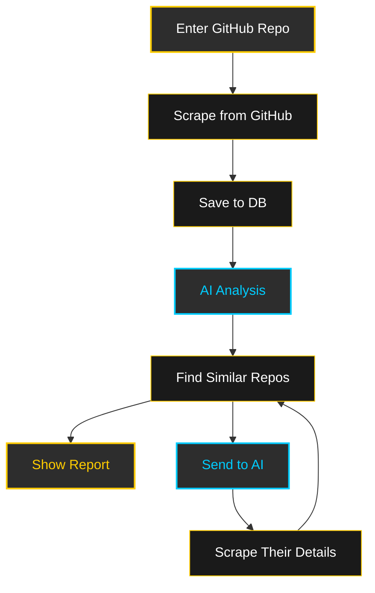

# GitHub Repo Summarizer

A **lightweight Python web scraper** that fetches a GitHub repository's README and uses the **Grok API (xAI)** to generate a clean, bullet-point description of the project.

### Made with **Python**, powered by **GROK**


---

## Features
- Scrape any public GitHub repo's README
- Summarize using Grok (`grok-4` or `grok-3`) via xAI API
- Returns **only** concise bullet points:
  - Project purpose
  - Tech stack
  - Key features
  - Target audience
- Secrets stored securely in `.env`
- Minimal dependencies

## Flow Chart



---

## Requirements
- Python 3.8+
- `requests`, `beautifulsoup4`, `python-dotenv`, `openai` (for xAI compatibility)

---

## Installation

```bash
# Clone or copy this project
git clone <your-repo-url>
cd github-repo-summarizer

# Create virtual environment
python3 -m venv .venv
source .venv/bin/activate  # Linux/macOS
# .venv\Scripts\activate   # Windows

# Install dependencies
pip install -r requirements.txt
```

---

## Setup

1. **Get your Grok API key**  
   → [console.x.ai](https://console.x.ai) → Create API key

2. **Create `.env` file** in the project root:

```env
GROK_API_KEY=your_xai_api_key_here
```

> Never commit `.env` to Git! Add to `.gitignore`.

---

## Usage

```python
from summarizer import summarize_github_repo

# Example: Summarize FastAPI
summary = summarize_github_repo("tiangolo/fastapi")
print(summary)
```

**Sample Output:**
```
- High-performance web framework for building APIs with Python 3.7+
- Built on Starlette and Pydantic for speed and validation
- Auto-generates OpenAPI and interactive docs (Swagger UI, ReDoc)
- Ideal for production APIs, microservices, and async backends
```

---

## Project Structure

```
.
├── llm.py              # Grok API client & prompt
├── scraper.py          # GitHub README fetcher
├── summarizer.py       # Main function
├── .env                # Your secrets (gitignored)
├── requirements.txt
└── README.md
```

---

## Example `requirements.txt`

```txt
requests
beautifulsoup4
python-dotenv
openai>=1.0.0
```

---

## Notes
- Uses `https://api.x.ai/v1` — fully compatible with OpenAI SDK
- Grok-4 gives best reasoning; use `grok-3-mini` for speed/cost
- Rate-limited by your xAI credits (monitor at [console.x.ai](https://console.x.ai))

---

## License
GPLv3

---

Built with Grok API | Simple. Fast. Bulletproof.

<br>


